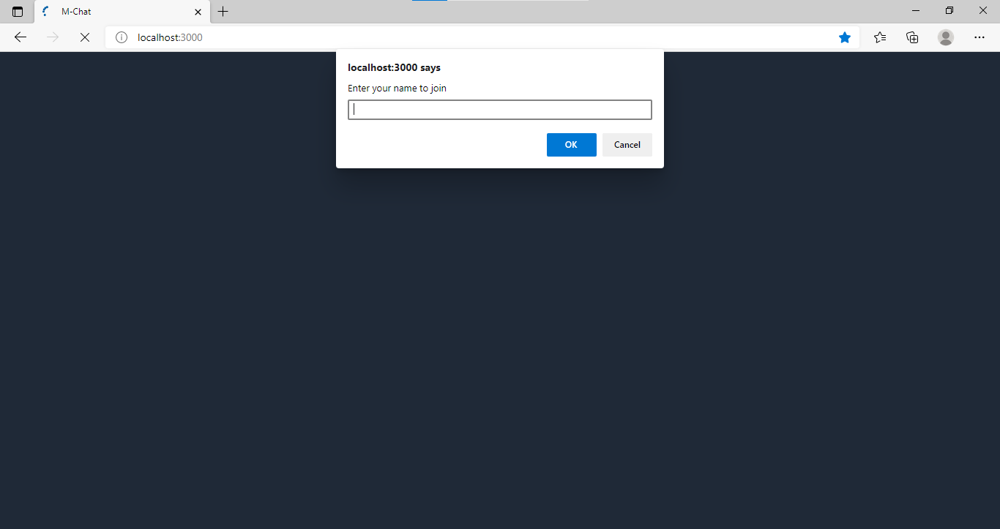
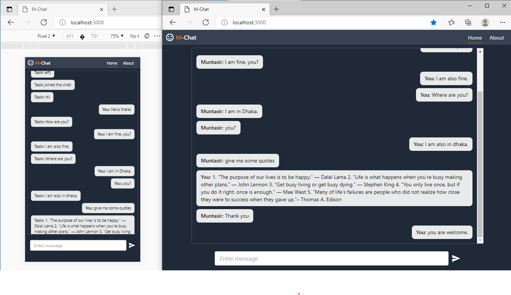
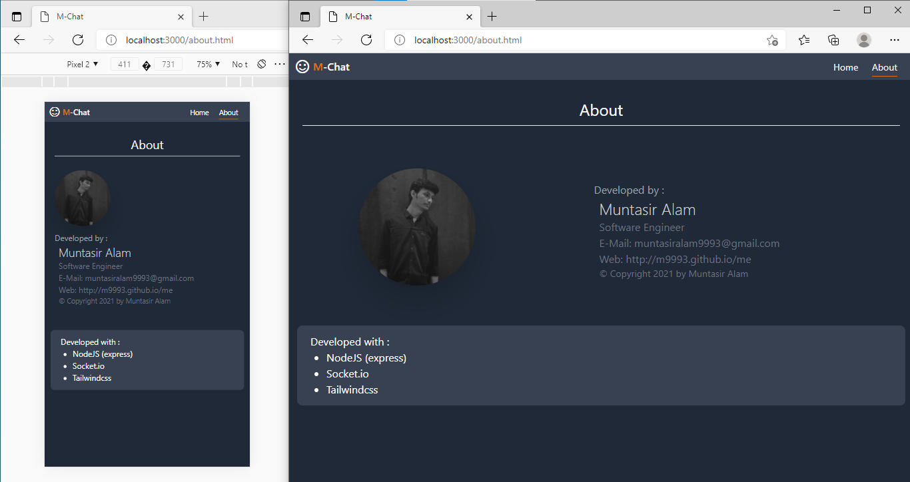

# M-Chat

A realtime chat application with responsive layout.


## Heroku Deployment

[View Live](https://node-mchat.herokuapp.com/)

  
## Tech Stack

**Client:** TailwindCSS, HTML, CSS, JavaScript

**Server:** Node, Express, Socket.io

  
## Screenshots





  
## Run Locally

Clone the project

```bash
  git clone https://github.com/m9993/node-mchat.git
```

Go to the project directory

```bash
  cd node-mchat
```

Install dependencies

```bash
  npm install
```

Start the server

```bash
  npm run start
```

  
## Features

- Real time chat
- Plays audio for incoming messages
- Responsive web design (RWD)

  
## License & Author

 - Github: [Muntasir Alam](https://www.github.com/m9993)
 - Web: [Muntasir Alam](https://m9993.github.io/me)


  


  
